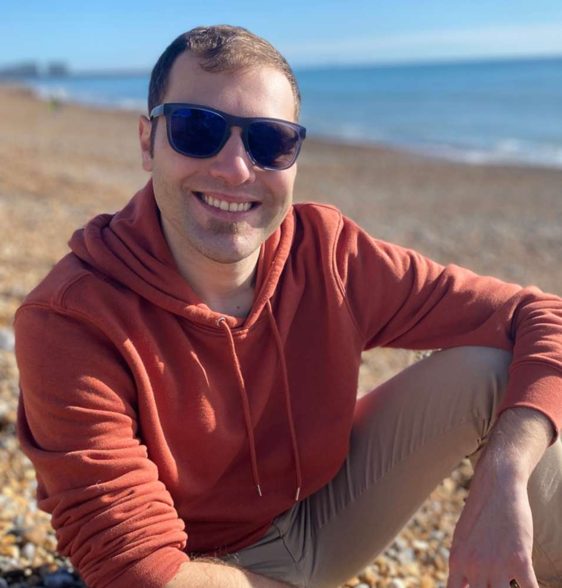



  <!-- Image Section -->
  

    
  

  <!-- Text Section -->
  

    
💻 <a href="projects.html#hitar">Tech innovator</a>

    
🎸 <a href="music.html">Musician and producer</a>

    
🤖 <a href="projects.html#meml">Edge AI expert</a>

    
<a href="https://www.linkedin.com/in/andrea-martelloni-7ab10a60/">Connect with me</a> or <a href="about.html#recent-work-history">see my CV</a>

  

