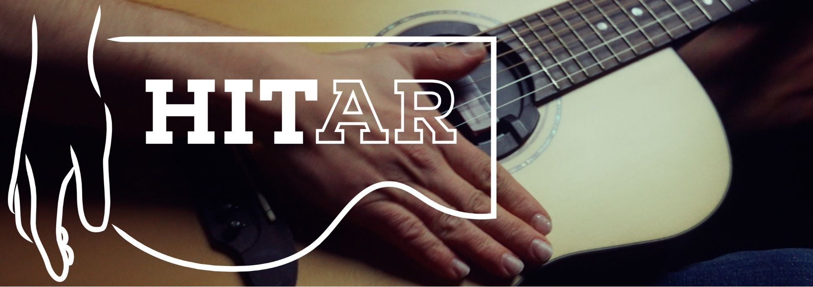
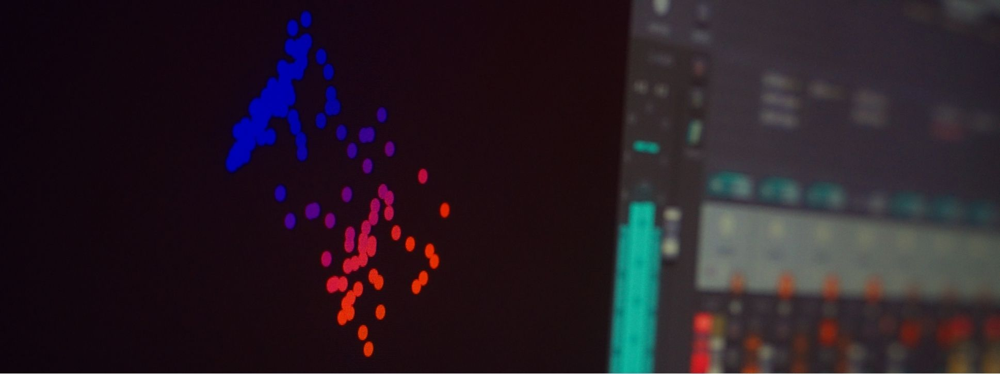



# Projects

## HITar

Freedom of expression at your fingertips.

  
  
<a href="https://jonjanofficial.com">Jonjan</a> playing the HITar

Messy pedalboards. Barely controllable digital sets. Many devices that do one thing, and can do one wrong thing. The life of the modern musician is filled with great technology, controlled with not-so-great interfaces. The HITar demonstrates a revolutionary technology to control loops, percussion, effects, and tech straight from your guitar's body, with the musicality and nuance that you expect from your guitar.

Imagine triggering a loop with a tap on the guitar's side. Imagine playing amazing drums alongside your song, all without missing a note. Stadium-ready performances coming just from your fingers and from your instrument. The HITar is all this, and much more.

### How does it work?

  
  
Intelligent Expression (iX) technology extracts a robust, rich description of your finger taps in real time

* Real-time AI tracking your percussive taps, 3 years of R&D
* Works from integrated contact pickups
* Bespoke embedded AI platform for ultra-low latency
* Built-in or retrofitted

### Accolades, press coverage

  

    

      
    

    <a href="https://www.youtube.com/watch?v=UGrzDVyRYgg"><strong>MIDI Innovation Awards 2023</strong></a> Best hardware prototype
  

  

    

      
    

    <a href="https://www.youtube.com/watch?v=2gYUdgnksj8"><strong>Guthman Competition 2023</strong></a> Third place
  

  

    

      
    

    <strong>Queen Mary Impact Fund</strong> 2x recipient
  

Exhibited at:

  

    

      
    

    NAMM 2024
  

  

    

      
    

    Music China 2023
  

Press coverage:
* [Reuters](https://www.reuters.com/lifestyle/will-ai-mean-death-music-or-herald-new-era-creativity-2024-02-01/)
* [Computer Times](https://computertimes.com/2024/02/04/namm-2024/)
* [The Economic Times](https://economictimes.indiatimes.com/tech/technology/will-ai-mean-the-death-of-music-or-herald-a-new-era-of-creativity/articleshow/107348565.cms?from=mdr)
* [Sic Noticias](https://sicnoticias.pt/olhares-pelo-mundo/2024-02-04-Inteligencia-Artificial-a-morte-da-musica-ou-uma-nova-era-de-criatividade--9a191943)
* [Rai TG Leonardo]()

## Team

[Andrea Martelloni](https://www.linkedin.com/in/andrea-martelloni-7ab10a60), inventor and software engineer
 
[Mathieu Barthet](https://uk.linkedin.com/in/mathieu-barthet), co-founding partner
 
[Andrew McPherson](https://uk.linkedin.com/in/andrewpmcpherson), advisor

### ...it can be in [YOUR](https://www.linkedin.com/in/andrea-martelloni-7ab10a60) guitar.

We can build a HITar for you.
 
We can help you make HITar a reality for your product line.
 
We can bring my expertise into your company.

## MEML

**Bridging AI and Artistry in Real-Time Musical Performance.**

While AI and Machine Learning are transforming music creation, many advanced models create a disconnect, distancing the intuitive act of performance from the technology. GenAI and large models often reduce musical interaction to prompts and clicks, bypassing the rich, nuanced control of a musician playing an instrument.

**MEML (Musically Embodied Machine Learning)** directly addresses this challenge. Funded by UK AHRC, our project isn't just about applying AI to music; it's about **embedding intelligent systems directly *within* musical instruments.** We empower performers by making AI an integral, controllable part of their live expression, allowing the instrument to learn and respond to their unique playing style in real-time.

**Our Approach & Technical Innovation:**
*   **Problem-Driven Solution:** We identified the growing gap between powerful AI and expressive musical control, and engineered a solution to bridge it.
*   **Custom Embedded AI/ML:** We developed a bespoke C++ framework for ML training and inference, optimized for ultra-low latency and real-time operation on resource-constrained embedded platforms. This demonstrates expertise in creating efficient, from-scratch solutions for resource-constrained environments.
*   **Interactive Reinforcement Learning:** We leverage reinforcement learning paradigms enabling AI models to be trained and adapted *during* the performance. This showcases practical application of advanced ML in dynamic, human-in-the-loop systems.
*   **Open & Collaborative:** Our hardware and software are open-source, fostering innovation through artist collaborations and educational workshops.

### Team

[Chris Kiefer](https://www.linkedin.com/in/chris-kiefer-a2b46611a/), principal investigator
 
[Andrea Martelloni](https://www.linkedin.com/in/andrea-martelloni-7ab10a60), PDRF and software engineer

### The MEML framework

* [meMLP](https://github.com/MusicallyEmbodiedML/memlp) - An embedded-first C++ ML/AI training and inference library with first-class support for reinforcement learning
* [memllib](https://github.com/MusicallyEmbodiedML/memllib) - A library to get started with embedded AI development on the RP2350 (Raspberry Pi Pico 2)

### [Main website](https://users.sussex.ac.uk/~ck84/meml/)

## Other projects

* [DSP Unittest Tutorial](https://github.com/martelloni/dsp_unittest_tutorial) - Step-by-step tutorial to run tests on C/C++ code from Python, with minimal library to get you productive in no time.
* [Virtual membrane](https://github.com/martelloni/virtualmembrane) - Simulation of a 2D membrane using a hexagonal mesh and digital waveguide modelling, C++ implementation for PC and Bela. Implements: Laird, J.A., 2001. The physical modelling of drums using digital waveguides (Doctoral dissertation, University of Bristol).